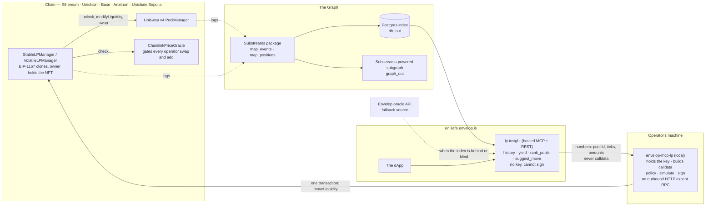

# unisafe — ETHOnline 2026

**Move liquidity between Uniswap v4 pools in a single transaction, and let an agent decide when to.**

This is the submission hub for [unisafe.envelop.is](https://unisafe.envelop.is) at ETHOnline 2026.
The code lives in the repositories linked below; this page tells you what we built during the event,
where to look, and how to run it.

Submitted under the **Continuity** track (*Extend Open Source*). Everything listed under
[What existed before](#what-existed-before-the-hackathon) predates the event and is not part of what
we are asking to be judged.

---

## The problem

unisafe manages Uniswap v4 liquidity through a **manager NFT**. Whoever holds the NFT owns the funds;
they may authorise **operators** — bots, agents, other people — who can rebalance the position but can
never withdraw. That boundary is enforced by the contract, not by trust: operator swaps are additionally
gated by a Chainlink price oracle, and there is no code path from an operator to the owner's principal.

The gap is what happens when a *different pool* becomes the better place to be. Today an operator has to:

1. `withdrawTo` — close the position and pull the capital back to the manager,
2. `allocate` — open a new position somewhere else.

Two transactions. Two intrinsic gas charges, two settlement passes, two separate oracle checks at two
different prices — and, between them, **a window where the capital sits idle**, earning nothing, while
the manager looks from the outside like the operator broke something.

The manager already has an operation that does remove → swap → re-add atomically (`recenter`), but it is
locked to a single pool.

## What we are building

**`moveLiquidity`** — one operator call that pulls liquidity from one or more pools and adds it to others
inside a single Uniswap v4 `unlock`, with one settlement pass and one oracle-guarded swap path.

This is possible because v4 keys deltas by `(address, currency)` rather than by pool, and `unlock`
checks exactly one thing on exit — that no non-zero delta remains. Nothing in v4 restricts a callback to
a single pool; the documentation simply never says so. We proved it with a standalone test before
touching the manager.

Around that, three supporting pieces:

- a **Substreams package** that decodes LP-manager events into typed protobuf, so positions, realised
  fees and operator changes are queryable without a full log scan;
- a **split of our MCP server** into a thin local signer and a hosted read/strategy service, so the
  component holding the operator key does nothing but build, check and sign transactions;
- a **deployment on Arc**, Circle's stablecoin-native L1, where USDC is the gas token.

**The end-to-end scenario, which is also the demo:** the hosted service ranks v4 pools by yield from
indexed data, proposes a better one, the local MCP server builds `moveLiquidity`, checks it against its
policy and simulates it — and one transaction moves the liquidity, with every swap inside it verified
against a Chainlink feed.

## How it fits together

The arrow that matters is the one from the hosted service to the local one: it carries **numbers, not
calldata**. A pool id, two ticks and an amount, which the local server re-derives against chain state and
puts through the same policy and oracle guard as a hand-written call. The component that can sign cannot
be handed something to sign.

---

## Repositories

| Repository | What is in it |
|---|---|
| [dao-envelop/uni-smart-wallet](https://github.com/dao-envelop/uni-smart-wallet) | Solidity contracts. `StableLPManager`, `VolatileLPManager`, `OpenVolatileLPManager`, the factory, `UniLens`, `ChainlinkPriceOracle`. **`moveLiquidity` lands here.** |
| [dao-envelop/ethonline-2026-substreams-v4-lp](https://github.com/dao-envelop/ethonline-2026-substreams-v4-lp) | Substreams package for the LP-manager event class. |
| [gitlab.com/envelop/protocol-v2/stablelp-ui](https://gitlab.com/envelop/protocol-v2/stablelp-ui) | The dApp and both MCP servers — the local signer (`mcp/`) and the hosted read/strategy service (`insight/`). Public. |
| [gitlab.com/envelop/protocol-v2](https://gitlab.com/envelop/protocol-v2) | Upstream home of the contracts and the frontend. Both public. |

> Specific file-and-line pointers for each track are in [Where to look](#where-to-look), so you do not
> have to go hunting.

---

## What existed before the hackathon

Stated plainly, because the Continuity track asks for it and because ~24k lines of audited contracts
should not look like a week's work.

- **The manager contracts**, live and non-upgradeable, deployed on Ethereum, Unichain, Unichain Sepolia,
  Base and Arbitrum. Three products: `StableLPManager` (oracle type 3000), `VolatileLPManager` (3001),
  `OpenVolatileLPManager` (3002, pools with hooks). Deployed instances are EIP-1167 clones.
- **The operator model**: owner-held singleton NFT, `setOperator`, and a contract-level guarantee that an
  operator cannot reach the principal. Operator swaps are checked against `ChainlinkPriceOracle` and fail
  closed when no feed is configured.
- **`recenter`** — atomic remove → swap → re-add, within one pool. `moveLiquidity` is its cross-pool
  generalisation.
- **The dApp** at unisafe.envelop.is — creating managers, allocating, recentering, position charts.
- **`@envelop/mcp-lp`** — a local MCP server giving an LLM agent the operator role, with a propose →
  simulate → execute loop, a default-deny policy guard and an encrypted keystore. Running against a real
  Arbitrum manager since July 2026.
- **An event indexer** (Envelop oracle) covering five chains, serving position history to the frontend.

## What we are building during the event

| # | Workstream | Repository |
|---|---|---|
| A | `moveLiquidity` — cross-pool move in one `unlock`, oracle-guarded, reporting realised fees | uni-smart-wallet |
| B | Substreams package over the manager's events + SQL sink | substreams-uniswap-v4-lp |
| C | Local MCP reduced to key, calldata, policy and broadcast; gains `propose_move` / `execute_move` | unisafe |
| D | Hosted read/strategy MCP over HTTP: history, yield, pool ranking, `suggest_move` | unisafe |
| E | Deployment on Arc (chain 5042) with Chainlink feeds and a USDC/EURC pool | uni-smart-wallet |

The split in C and D is the point, not an implementation detail. The component that holds the operator
key ends up with **no outbound HTTP at all except RPC**. The hosted service can suggest a move; it can
never produce a signature, and everything it suggests is re-derived and re-checked locally before
anything is signed.

---

## Where to look

*Filled in as each piece lands — see [Status](#status).*

**Uniswap** — the new operation and the test that justifies it, on `master` and deployed on all five chains:
- [`src/VolatileLPManager.sol`](https://github.com/dao-envelop/uni-smart-wallet/blob/master/src/VolatileLPManager.sol)
  — `moveLiquidity`, its `_handleMove` handler, and `_guardedSwap`, the one swap path allocate, recenter
  and move all share
- [`test/CrossPoolUnlock.t.sol`](https://github.com/dao-envelop/uni-smart-wallet/blob/master/test/CrossPoolUnlock.t.sol)
  — manager-free proof that v4 permits several pools in one `unlock`, written before the manager was touched
- [`test/VolatileLPManagerMove.t.sol`](https://github.com/dao-envelop/uni-smart-wallet/blob/master/test/VolatileLPManagerMove.t.sol)
  — 17 tests: behaviour, the oracle matrix, the "nothing leaves the manager" check, and the gas benchmark
- [`FEEDBACK.md`](https://github.com/dao-envelop/uni-smart-wallet/blob/master/FEEDBACK.md) — the seven things that cost us time building over v4

**The Graph** — the package and what consumes it:
- [`proto/envelop/lp/v1/lp.proto`](https://github.com/dao-envelop/ethonline-2026-substreams-v4-lp/blob/master/proto/envelop/lp/v1/lp.proto)
  — one message type per event, amounts as base-unit decimal strings
- [`src/lib.rs`](https://github.com/dao-envelop/ethonline-2026-substreams-v4-lp/blob/master/src/lib.rs)
  — the four modules; the registry is built from the factory's deployment event, not an address list
- [`substreams.yaml`](https://github.com/dao-envelop/ethonline-2026-substreams-v4-lp/blob/master/substreams.yaml)
  — factory address as the only parameter, per-chain table in that repo's README
- the package is **published to the registry**: [`envelop-lp-v4`](https://substreams.dev/packages/envelop-lp-v4),
  so anyone can import it the way we import someone else's
- **composition with a published package**: `substreams.yaml` imports
  [`ethereum-common`](https://substreams.dev/packages/ethereum-common/v0.3.3) and uses its `index_events`
  as a block filter, so a block holding none of our eleven signatures is never opened. Measured on
  mainnet: 58,876 blocks in scope, 1,149 processed
- [`schema.graphql`](https://github.com/dao-envelop/ethonline-2026-substreams-v4-lp/blob/master/schema.graphql)
  and `graph_out` — written and verified on Unichain, but **Subgraph Studio no longer accepts
  substreams-powered subgraphs** (its words: "no longer supported"), which is why the second Graph
  product here is the published package and the composition rather than a hosted subgraph
- verified against Arbitrum One and cross-checked with the production oracle, and `graph_out` verified on
  Unichain (manager creation at 54,551,071, first allocate at 54,572,737) — see that repo's README
- the hosted service reads the index live at `unisafe.envelop.is/mcp`, with the fallback cascade below

**Chainlink** — price feeds gating operator swaps:
- [`src/oracle/ChainlinkPriceOracle.sol`](https://github.com/dao-envelop/uni-smart-wallet/blob/master/src/oracle/ChainlinkPriceOracle.sol)
  and `_guardSwap` in [`src/BaseLPManager.sol`](https://github.com/dao-envelop/uni-smart-wallet/blob/master/src/BaseLPManager.sol)
- the on-chain state change: a new `ChainlinkPriceOracle` deployed on all five chains on 8 September and
  seeded with feeds, plus the spot branch added during the event — `check` with `amountIn == 0` compares
  the pool's `slot0` against the Chainlink reference in both directions, which is what now gates an
  operator's liquidity adds and not only its swaps
- feed wiring on Arc _(pending — Arc mainnet has 30 feeds; see [Status](#status))_

**Arc** — deployment and addresses _(pending)_

**Storage** — [`db/`](db/): what the Substreams SQL sink writes and why it is shaped that way. Twelve
tables — eleven event types plus `position_delta`, the one that actually models a position.

## Status

| | | |
|---|---|---|
| A | `moveLiquidity` | ✅ implemented, deployed on all five chains 8 Sep (release 2.1.0), and in the dApp — an owner can move a position between pools, not only an agent |
| B | Substreams package | ✅ published on [substreams.dev](https://substreams.dev/packages/envelop-lp-v4); SQL sink live on Ethereum and Unichain; composed with a published third-party package. Subgraph Studio no longer accepts substreams-powered subgraphs — see below |
| C | Local MCP slimmed + `move` | ✅ published — `@envelop/mcp-lp` 1.0.0 |
| D | Hosted read/strategy MCP | ✅ live at `unisafe.envelop.is/mcp`, and the dApp reads it first: index → oracle → chain, with the source named on screen |
| E | Arc deployment | ⬜ out of this submission — Arc mainnet has no public RPC and the owner postponed it |
| — | Demo video | 🟡 script and shot list written; one precondition left |

Submitting to three tracks: **Uniswap**, **The Graph** and **Chainlink**. Arc is not among them.

Event runs 4–13 September 2026. The full plan, the reasoning behind each decision and a dated progress
log are in **[PLAN.md](PLAN.md)** — published before the work, and corrected in place when reality
disagrees with it.

## Demo

_Video and transaction hashes go here._

---

## Rules and disclosure

- **Continuity.** Submitted under *Extend Open Source*. Pre-existing work is listed above; only work done
  between 4 and 13 September 2026 is offered for judging.
- **History.** Work is committed incrementally as it happens, in the repositories linked above. No squashed
  dumps.
- **AI usage.** Disclosed in **[AI_USAGE.md](AI_USAGE.md)**, including what the tooling did, what it did
  not decide, and where it was wrong.
- **Dependencies.** Open-source and named: Uniswap v4 core and periphery, OpenZeppelin, Foundry, the
  Substreams SDKs, viem, Next.js.
- [ETHGlobal rules and code of conduct](https://ethglobal.com/rules).

## Links

- Live app — https://unisafe.envelop.is
- Plan and progress log — [PLAN.md](PLAN.md)
- Contracts — https://github.com/dao-envelop/uni-smart-wallet
- Envelop — https://envelop.is

## License

MIT, matching the repositories it links to.
