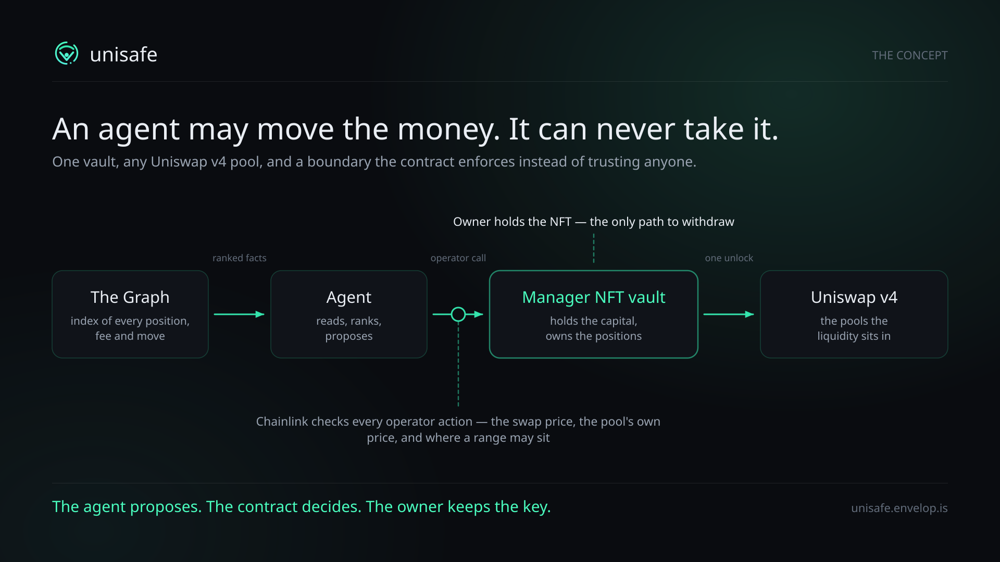
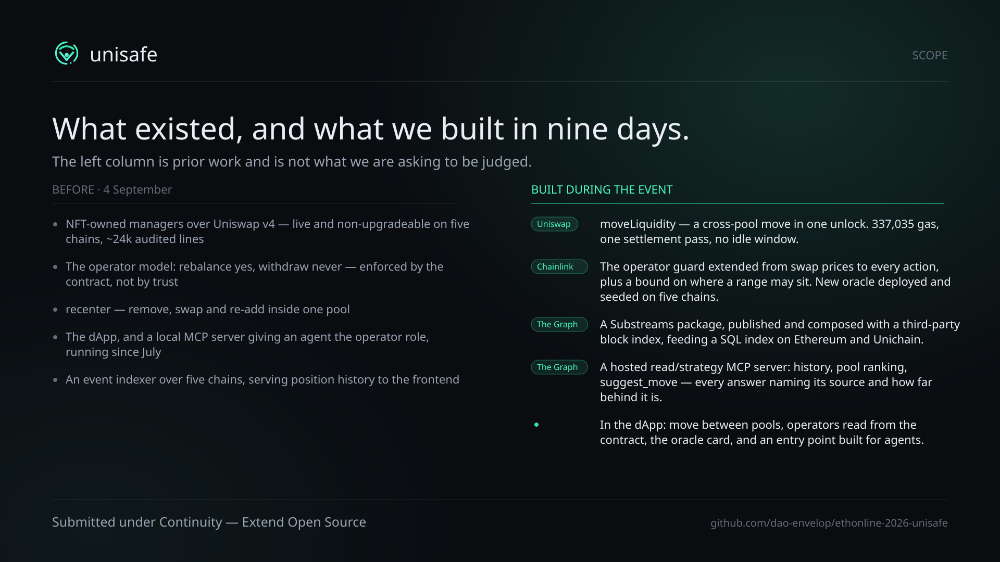

# unisafe

<p class="lede">Move liquidity between Uniswap v4 pools in one transaction —<br/>and let an agent decide when to.</p>

<p class="subtitle">ETHOnline 2026 · Continuity — Extend Open Source</p>

<span class="badge">Uniswap</span> <span class="badge">Chainlink</span> <span class="badge">The Graph</span>

Note: Seven slides, then the two cards that close the video.

---

## What it is

- A **manager NFT** owns the funds. Whoever holds the token owns the capital.
- The owner may authorise **operators** — bots, agents, other people — who can rebalance a position
  and can **never withdraw**. That boundary is in the contract, not in the terms of service.
- Live and non-upgradeable on Ethereum, Unichain, Base, Arbitrum and Unichain Sepolia.

<p class="muted">~24k lines of audited contracts predate this event. What was built during it is on the last slide.</p>

---

## The gap we closed

When a *different pool* becomes the better place to be, an operator had to send **two transactions**:

```text
withdrawTo   →   close the position, pull capital back
allocate     →   open a new one somewhere else
```

Two intrinsic gas charges. Two oracle checks at two different prices. And between them, **a window
where the capital earns nothing** while the manager looks, from outside, like the operator broke it.

<p class="muted">`recenter` already did remove → swap → re-add atomically — but only inside one pool.</p>

---

## `moveLiquidity`

<p class="lede">One operator call. One Uniswap v4 <code>unlock</code>. One settlement pass.</p>

<p class="figure">337,035 gas</p>

against **381,744 + 21,000** for the two-call path it replaces — and the idle window gone.

<p class="muted">Measured from equal fresh state, same pair, no intermediate swap. The first version of
that benchmark ran both paths in one test and made the move look 37% <em>more</em> expensive, because
whichever path runs second inherits the other's warm storage.</p>

---

## Why v4 permits it

- Deltas are keyed by **`(address, currency)`**, not by pool. That is what makes several pools legal
  inside one `unlock` — and nothing in the docs says so.
- `unlock` checks **exactly one thing** on exit: `NonzeroDeltaCount != 0`.

We only believed it after reading `PoolManager._accountDelta` and proving it against a **bare
`PoolManager`**, before touching the manager — [`test/CrossPoolUnlock.t.sol`](https://github.com/dao-envelop/uni-smart-wallet/blob/master/test/CrossPoolUnlock.t.sol).

<p class="muted">EIP-170 then decided the API's shape, not taste: the array form needed 947 bytes
against 858 of headroom, so the call moves one position to one destination. The largest manager ships
with 46 bytes free of 24,576.</p>

---

## Chainlink — the boundary, enforced

An audit on 4 September found the hole: an operator could add liquidity **without swapping at all**,
at whatever the pool's spot price happened to be, and park principal at a distorted price.

- **Every** operator action is now priced against a feed — not only swaps.
- A range's **midpoint must sit within θ of the reference**. The loss from a parked range *is* its
  distance from fair value, so bounding the distance bounds the loss.
- **One operator action per transaction**, so a batch cannot walk the pool between checks.

<p class="muted">New oracle contracts deployed and seeded with feeds on five chains, 8 September.
A refusal is a revert — so a successful operator transaction is the oracle's signature on it.</p>

---

## The Graph — the memory

- A Substreams package over a **class** of contracts: the manager registry is built from the factory's
  own deployment event, so the factory address is the only parameter.
- **Composed with a published package** — `ethereum-common`'s `index_events` as a block filter:
  58,876 blocks in scope on mainnet, **1,149 processed**. Billing is per block, so this is what makes
  the backfill affordable at all.
- The SQL index it feeds answers a hosted **MCP server**: history, realised fees, who may operate,
  which pool pays best, whether a move is worth it.

Every answer **names the source that served it and how far behind that source is**. An index past its
staleness budget declines and says so, instead of answering confidently with old data.

---

## It runs in production

Four operator `moveLiquidity` calls on Unichain, 10–11 September. One of them,
[`0xc2a93eac…`](https://uniscan.xyz/tx/0xc2a93eac8fea442f8e022766dcd2b9d768ca9eed7504bc786c0d42c45014c888):

| In one transaction | |
|---|---|
| `ModifyLiquidity` ×2 | **two different pools** — −1,446,934 out of `0xbd0f3a7c…`, +13,713,827,842 into `0x51f9d63d…` |
| `Swap` ×1 | in the destination pool, because the pairs differ |
| `FeesCollected` | the fees the removal realised, reported rather than swallowed |
| `LiquidityMoved` → `MetadataUpdate` | the NFT's rendered state follows in the same transaction |

<p class="muted">Plus eight operator <code>recenter</code> calls on Arbitrum since 25 July — the same
key, the same server, before any of this event's work existed.</p>

---



Note: End card 1 — the concept. 7 seconds in the video.

---



Note: End card 2 — scope. 7 seconds in the video.

---

## Where to look

| | |
|---|---|
| Submission hub | [github.com/dao-envelop/ethonline-2026-unisafe](https://github.com/dao-envelop/ethonline-2026-unisafe) |
| Contracts | [dao-envelop/uni-smart-wallet](https://github.com/dao-envelop/uni-smart-wallet) — `moveLiquidity`, the oracle, the tests |
| Substreams package | [dao-envelop/ethonline-2026-substreams-v4-lp](https://github.com/dao-envelop/ethonline-2026-substreams-v4-lp) · [substreams.dev](https://substreams.dev/packages/envelop-lp-v4) |
| Frontend + both MCP servers | [dao-envelop/ethonline-2026-frontend-mirror](https://github.com/dao-envelop/ethonline-2026-frontend-mirror) |
| Live | [unisafe.envelop.is](https://unisafe.envelop.is) · agents start at [/agents](https://unisafe.envelop.is/agents) |

<p class="lede">The agent proposes. The contract decides. The owner keeps the key.</p>
